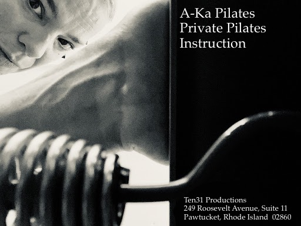
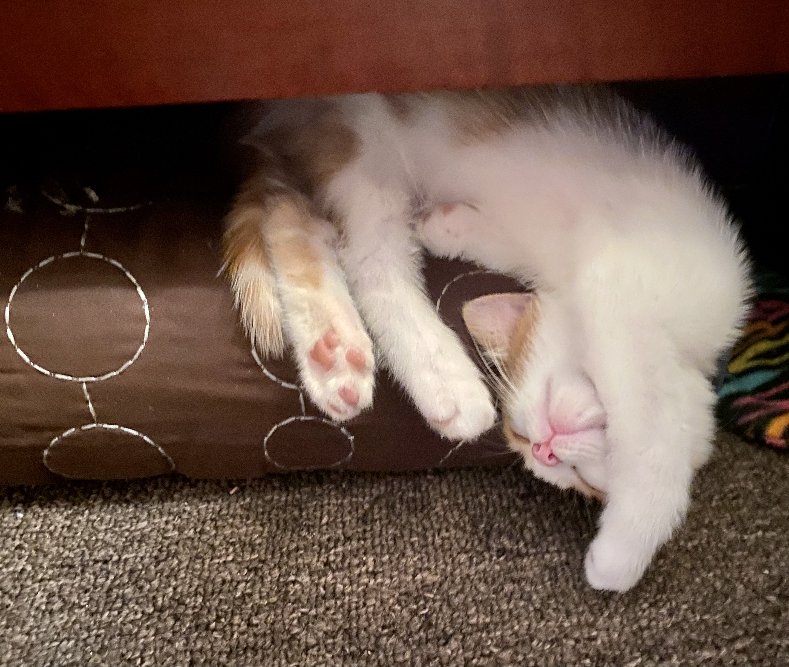

# Contact

Email: akapilates@gmail.com

Ten31 Productions
249 Roosevelt Avenue, Suite 11
Pawtucket, Rhode Island  02860 

# Cost
I believe this kind of practice should be for all people so I work with a sliding scale to accommodate various economic circumstances.

A guidance: 
Hour private: 40/60/80 
Half hour: 20/30/40
 

# Bio
Creating an environment where everyBody can move, condition, release and make a physical home for the constant shifts.

Katie has had an evolving twenty four year career as a movement and Pilates teacher and is certified through NPCP. She came to Pilates as a professional dancer in Philadelphia and continued her training here in Rhode Island with Jen McWalter, Cheryl Turnquist and many others which instilled both a love of classical pilates and all that springs forth. During the pandemic she was able to deepen her knowledge taking live dissection workshops with Tom Myers (Anatomy Trains). Her dance background has highly informed her Pilates teaching, particularly within ideas of anatomic imagery, rhythm, breath, direction, balance and the joy of movement. In the fall Katie will start a certification process through the Franklin Method which teaches science based methods of functional movement. Katie also teaches yoga and dance technique and has taught dance composition and theory. She holds a BA in Dance and Anthropology from Connecticut College and an MFA in Dance Performance from University of Wisconsin, Milwaukee.

# Experience

I offer a Pilates-based mindful movement workout with emphasis on heightened sensitivity, imagination and functional conditioning. Joseph Pilates and those that continue his teachings enhanced physical function and healing with spring tension, breath, rhythm, balance and my practice has been highly influenced by this legacy. I work with Balanced Body equipment and use a variety of props for deepening in specific areas and working with each individuals’ needs. While it is a Pilates based workout there is an emphasis on efficiency and autonomy.

